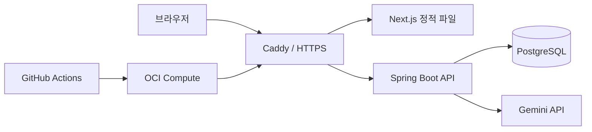

# TRI:READ 백엔드

TRI:READ는 이동 시간에도 부담 없이 풀 수 있는 고3 수준의 비문학 독해 서비스입니다. 이 저장소는 인증, 퀴즈, 오답 복습, 학습 기록, 그룹 기능과 AI 문제 생성을 담당하는 Spring Boot API 서버입니다.

## 현재 학습 정책

- 평일마다 서로 다른 영역의 지문 3개와 지문별 객관식 3문제를 제공합니다.
- 사용자는 원하는 지문 하나를 골라 3문제를 풀면 오늘의 필수 학습을 완료합니다.
- 필수 학습 완료 후 남은 지문 2개는 보너스로 선택해 풀 수 있습니다.
- 한 사용자에게 배정된 날짜별 퀴즈 세트는 새로고침하거나 다시 로그인해도 바뀌지 않습니다.
- 주말 학습은 강제가 아니며, 해당 주의 비어 있는 평일 기록을 가장 이른 날짜부터 채웁니다.
- 정답만 맞힌 지문은 즉시 복습 완료로 기록되고, 오답이 있으면 모든 오답을 복습한 뒤 완료됩니다.

## 기술 스택

- Java 21
- Spring Boot 4.1
- Gradle
- Spring Security 세션 인증 및 CSRF
- MyBatis XML Mapper
- PostgreSQL
- Flyway
- Docker Compose
- Caddy
- Gemini API
- GitHub Actions
- OCI Compute

## 한눈에 보는 구조



Caddy가 한 도메인에서 정적 프론트엔드와 `/api/*` 요청을 나눠 처리합니다. 브라우저는 서버 세션과 CSRF 토큰으로 인증하며, Spring Boot만 PostgreSQL과 Gemini API에 접근합니다.

- [상세 아키텍처, 핵심 ERD와 설계 결정](docs/architecture.md)
- [브랜치 및 배포 정책](docs/branching-and-release.md)
- [API 명세](docs/api.md)
- [운영 장애 대응과 복원 절차](docs/operations.md)
- [버전별 변경 이력](CHANGELOG.md)

## 주요 기능

- PIN 기반 회원가입, 로그인, 로그아웃과 본인 PIN 변경
- 오늘의 퀴즈 배정 및 필수/보너스 풀이
- 채점, 풀이 기록과 오답 복습
- 주간/월간 학습 기록 및 연속 학습일 계산
- 여러 학습 그룹 가입, 만료·사용 횟수가 있는 초대 코드와 그룹 활동 조회
- 그룹 멤버 제외와 소유권 이전
- 관리자 퀴즈 작성, 수정, 검수와 발행
- Gemini 기반 문제 생성 및 자동 검증
- 최근 뉴스 근거 수집, 출처 저장과 관리자 검토
- 생성·검증 프롬프트 버전과 활성화 이력 관리
- 관리자 운영 현황, 퀴즈 재고, 장애·백업·스케줄러 모니터링
- 실제 풀이 데이터 기반 문항 난이도와 오답 쏠림 품질 모니터링
- OCI 배포와 DuckDNS IP 갱신

## 로컬 실행

로컬 PostgreSQL은 Docker Compose로 실행하고 애플리케이션은 Gradle로 실행하는 구성을 권장합니다.

```powershell
docker compose -p tri-read-dev -f compose.db.yaml up -d
```

기본 개발용 DB 접속 정보는 다음과 같습니다.

```text
URL: jdbc:postgresql://localhost:15432/tri_read
사용자: tri_read_app
비밀번호: tri_read_dev
```

애플리케이션이 시작될 때 Flyway가 `src/main/resources/db/migration`의 스키마를 자동 적용합니다.

```powershell
.\gradlew.bat test
.\gradlew.bat bootRun
```

### Gemini 키 설정

`config/application-secret.example.yml`을 `config/application-secret.yml`로 복사하고 아래 항목에 로컬 Gemini API 키를 넣습니다.

```yaml
app:
  auth:
    bootstrap-admin-login-name: "관리자로 지정할 기존 로그인 아이디"
  quiz-generation:
    gemini:
      api-key: "발급받은 키"
```

실제 `application-secret.yml`은 Git에서 제외되며 JAR에도 포함되지 않습니다. 키가 들어 있는 파일은 커밋하지 않습니다.

`bootstrap-admin-login-name`과 일치하는 사용자가 있으면 서버 시작 시 `ADMIN`으로 승격됩니다. 승격 후 값을 비워도 DB의 관리자 권한은 유지됩니다. 현재 규모에서는 사용자 행의 `app_role`로 `USER`와 `ADMIN`을 구분합니다. 세부 권한이 여러 종류로 늘어날 때 역할·권한 테이블로 분리합니다.

## 주요 API

브라우저는 상태 변경 요청 전에 `GET /api/csrf`로 CSRF 토큰을 받습니다. 인증이 필요한 API는 서버 세션 쿠키를 사용합니다.

```text
# 인증
POST /api/auth/signup
POST /api/auth/login
POST /api/auth/logout
GET  /api/auth/me
PATCH /api/auth/pin

# 퀴즈
GET  /api/quizzes/today
POST /api/quizzes/{quizSetId}/attempts

# 오답 복습
GET   /api/reviews?status=OPEN
GET   /api/reviews/{reviewId}
PATCH /api/reviews/{reviewId}

# 학습 기록
GET /api/orbit?period=WEEK&anchor=2026-07-18
GET /api/orbit?period=MONTH&anchor=2026-07-18
GET /api/orbit/streak

# 그룹
POST /api/groups
GET  /api/groups/my
GET  /api/groups/{groupId}
POST /api/groups/join
POST /api/groups/{groupId}/invites
GET  /api/groups/{groupId}/invites
DELETE /api/groups/{groupId}/invites/{inviteId}
DELETE /api/groups/{groupId}/members/{userId}
PATCH /api/groups/{groupId}/owner
GET  /api/groups/{groupId}/activity
```

퀴즈 제출 요청은 한 지문에 속한 정확히 3개의 답을 포함해야 합니다. 첫 제출은 `PRIMARY`, 이후 다른 지문의 제출은 `BONUS`로 저장됩니다.

`PRIMARY` 제출 하나가 그날의 필수 학습과 스트릭을 완료합니다. `BONUS` 제출은 같은 날짜의 추가 학습 기록으로만 저장되며 스트릭을 중복 증가시키지 않습니다. 한 지문은 한 번만 제출할 수 있어 하루 최대 3개의 응시와 9개의 문항 답안이 저장됩니다.

## 관리자와 문제 생성

관리자는 퀴즈 초안을 작성하거나 Gemini로 생성한 문제를 검수한 뒤 발행할 수 있습니다. 서버는 퀴즈 한 세트가 지문 3개, 지문별 문제 3개, 문제별 선택지 4개인지 검증합니다.

```text
GET    /api/admin/quizzes
GET    /api/admin/quizzes/{quizSetId}
POST   /api/admin/quizzes
PUT    /api/admin/quizzes/{quizSetId}
DELETE /api/admin/quizzes/{quizSetId}
POST   /api/admin/quizzes/{quizSetId}/publish

POST /api/admin/quiz-generations
GET  /api/admin/quiz-generations
GET  /api/admin/quiz-generations/{generationLogId}
POST /api/admin/quiz-generations/{generationLogId}/retry

GET   /api/admin/users
PATCH /api/admin/users/{userId}/role
PATCH /api/admin/users/{userId}/enabled
PATCH /api/admin/users/{userId}/pin

GET  /api/admin/prompts?type=GENERATION&page=0&size=8
POST /api/admin/prompts
POST /api/admin/prompts/{promptTemplateId}/activate

GET    /api/admin/security/login-locks
DELETE /api/admin/security/login-locks/{loginName}
GET    /api/admin/audit-logs
GET    /api/admin/operations/summary
GET    /api/admin/quiz-quality?page=0&size=10&status=&keyword=
```

AI 생성 결과는 서버 규칙 검증과 최근 지문의 제목·주제·본문 유사도 검사를 통과해야 `REVIEWED` 상태가 됩니다. 별도의 Gemini 2차 검증은 호출 비용을 통제하기 위해 기본적으로 꺼져 있으며 `QUIZ_AI_VALIDATION_ENABLED=true`일 때만 추가로 실행합니다. 자동 발행은 기본적으로 꺼져 있어 관리자가 최종 내용을 확인할 수 있습니다. 실패 기록은 관리자 화면에서 원인을 확인하고 다시 생성할 수 있습니다.

Google Search Grounding을 사용하는 출처 탐색은 선택 기능이며 기본값은 꺼져 있습니다. 무료 등급의 기본 생성 경로는 출처 탐색 호출 없이 프롬프트, 최근 지문 중복 검사, 규칙 기반 검증으로 동작합니다. 사용 중인 Google AI 프로젝트와 모델이 Grounding을 지원할 때만 `QUIZ_SOURCE_GROUNDING_ENABLED=true`로 활성화합니다. 활성화하면 각 지문 영역의 출처와 요약을 생성 이력에 저장하고 재시도 때 재사용하며, 관리자가 근거 자료를 검토할 수 있습니다. 최근 자료 활용이 더 중요해지면 RSS나 공개 데이터 수집을 Gemini 호출과 분리하는 방향으로 확장합니다.

첫 생성 결과가 검증에 실패하면 다음 시도에서는 전체 세트를 버리지 않고 오류가 발생한 지문만 다시 생성합니다. 서버는 규칙·중복·선택적 AI 검증에서 받은 지문 위치와 실패 원인을 Gemini에 전달하고, 통과한 지문은 그대로 보존합니다. 각 문항은 유형(`COMPREHENSION`, `INFERENCE`, `APPLICATION`, `ARGUMENT_STRUCTURE`)과 선택지 4개 각각의 판단 근거를 함께 생성하며, 서버는 지문별 문항 유형 다양성, 근거 개수와 최소 설명 길이를 저장 전에 검사합니다. 부분 재생성 호출은 `REPAIR` 용도로 기록되어 관리자 생성 로그와 일일 호출량에 포함됩니다.

기본 생성 스케줄은 매일 새벽에 향후 평일 3일의 재고를 확인하고, 30분 뒤 한 차례 더 부족분을 복구합니다. 시간은 `QUIZ_GENERATION_CRON`, `QUIZ_GENERATION_RECOVERY_CRON`으로 조정합니다. 각 날짜는 최대 3세트를 보유하며 사용되지 않은 기존 발행 문제를 우선 재배정해 Gemini 호출을 줄입니다.

호출량 보호를 위해 기본값은 스케줄 실행당 최대 3개 작업, 하루 최대 3개 작업, 작업당 최대 2회 시도, 실제 Gemini API 호출 하루 최대 6회입니다. 두 한도는 서울 기준 자정에 초기화되며 실패한 생성도 사용량에 포함됩니다. Gemini가 `429 Too Many Requests`를 반환하면 같은 자동 실행의 남은 생성을 즉시 중단하고 기본 6시간 동안 자동 생성만 쉬게 합니다. 수동 재시도는 계속 사용할 수 있으며, 냉각 시간은 `QUIZ_GENERATION_RATE_LIMIT_COOLDOWN_MINUTES`로 조정합니다. 중복 검사는 최근 DB 지문을 이용한 로컬 검사로 처리하고, 선택적으로 켠 AI 검증은 로컬 규칙과 중복 검사를 통과한 결과에만 수행합니다. `QUIZ_INVENTORY_DAYS`, `QUIZ_GENERATION_MAX_JOBS_PER_RUN`, `QUIZ_GENERATION_MAX_JOBS_PER_DAY`, `QUIZ_GENERATION_MAX_ATTEMPTS`, `QUIZ_GENERATION_MAX_API_CALLS_PER_DAY`로 값을 조정할 수 있습니다. 관리자 운영 현황에서 오늘의 호출량, 오류 코드와 자동 생성 재개 시각을 확인할 수 있습니다.

생성용과 검증용 프롬프트는 DB에서 독립된 불변 버전으로 관리합니다. 새 버전을 저장해도 즉시 적용되지 않으며 관리자가 활성화해야 다음 생성 작업부터 사용됩니다. 활성화 이력은 롤백 기록을 포함해 보존하고, 생성 작업은 시작할 때 활성 프롬프트 두 개를 한 번 읽어 같은 작업의 모든 재시도에 고정합니다. 생성 로그와 퀴즈 세트에는 실제 사용한 두 프롬프트 ID가 저장됩니다.

관리자 권한 변경은 다음 로그인부터 새 세션에 반영됩니다. 현재 로그인한 관리자의 자기 강등과 마지막 관리자 강등은 서버에서 차단합니다.

관리자 화면의 보안·감사 메뉴에서는 로그인 실패 제한으로 잠긴 아이디를 확인하고 해제할 수 있습니다. 퀴즈 생성·재시도·편집·발행·삭제, 프롬프트 저장·활성화, 사용자 권한 변경과 로그인 잠금 해제는 관리자 작업 이력에 남습니다.

관리자 운영 현황은 애플리케이션·DB 상태와 가동 시간, 배포 버전, DB 크기, 당일 Gemini 호출과 오류 코드, 향후 7일 퀴즈 재고, 최근 7일 생성 품질, 최근 실패와 관리자 작업을 보여 줍니다. 생성 스케줄러와 DB 백업은 `operation_events`에 시작·성공·실패를 남겨 마지막 실행 상태를 같은 화면에서 확인할 수 있습니다.

## 실제 풀이 기반 퀴즈 품질

관리자 퀴즈 품질 화면은 Gemini를 추가 호출하지 않고 `attempt_answers`에 저장된 실제 풀이 결과를 문항별로 집계합니다. 상태·검색어 필터와 서버 페이지네이션을 지원하며, 문항 상세에서는 선택지별 응답 수와 비율을 확인할 수 있습니다.

- `DATA_INSUFFICIENT`: 전체 응답이 5건 미만
- `REVIEW_REQUIRED`: 정답률이 30% 미만 또는 90% 초과
- `REVIEW_REQUIRED`: 오답이 3건 이상이고 가장 많이 선택된 오답의 비율이 70% 이상
- `NORMAL`: 응답이 충분하고 위 검토 조건에 해당하지 않음

이 판정은 검토 대상을 빠르게 찾기 위한 읽기 전용 지표입니다. 문항을 자동 삭제하거나 발행을 취소하지 않습니다. 운영 현황의 `최근 7일 생성 품질`은 생성 단계의 자동 검증 결과이고, 이 화면은 사용자 풀이 이후의 실사용 품질이라는 점에서 서로 다른 지표입니다.

## 배포

운영 환경은 OCI 인스턴스에서 Docker Compose로 Spring Boot, PostgreSQL, Caddy를 실행합니다. 외부에는 Caddy의 80/443 포트만 공개하고 애플리케이션과 DB는 Docker 내부 네트워크에 둡니다.

```powershell
cd deploy
Copy-Item .env.example .env
docker compose up --build -d
```

`dev` 브랜치에서 개발하고 CI를 통과한 변경을 매일 오전 9시 또는 수동 실행으로 PR을 만들어 `main`에 승격합니다. 승격 워크플로는 기존 PR이 있으면 재사용하고 필수 검사를 기다린 뒤 자동 병합합니다. `main` CI가 성공하면 같은 실행 안에서 재사용 배포 워크플로를 호출하며, 승격 작업은 OCI 배포와 운영 스모크 테스트가 끝날 때까지 대기합니다.

```text
dev push -> dev CI -> 승격 PR -> 필수 검사 -> main 자동 병합 -> main CI -> OCI 백엔드 배포 -> 운영 스모크 테스트
```

`main`은 백엔드 배포 기준 브랜치이며, 백엔드 배포는 프론트엔드 빌드나 정적 파일을 포함하지 않습니다. 프론트엔드는 별도 저장소의 `main`과 배포 워크플로에서 독립적으로 배포합니다. 긴급 재배포만 `Deploy backend to OCI` 워크플로를 수동 실행합니다.

배포가 끝나면 워크플로가 운영 홈페이지와 `/api/health`를 호출합니다. 두 응답 중 하나라도 비정상이면 배포 작업을 실패로 표시합니다.

## DB 백업과 복원

`Backup production database` GitHub Actions 워크플로는 매일 한국 시간 오전 2시 30분에 PostgreSQL custom-format dump를 생성합니다. dump는 `BACKUP_ENCRYPTION_KEY`로 AES-256 암호화합니다. 이어서 격리된 임시 PostgreSQL 18 컨테이너에 암호화 파일을 실제 복원하고 Flyway 이력 및 핵심 테이블을 검사합니다. 복원 검증에 성공한 백업만 GitHub Actions artifact에 14일 동안 보관하며, 평문 dump와 임시 DB는 runner에서 즉시 삭제합니다.

필요한 GitHub Actions secret은 다음과 같습니다.

```text
OCI_HOST
OCI_USER
OCI_SSH_PRIVATE_KEY
BACKUP_ENCRYPTION_KEY
```

복원은 먼저 Actions에서 `.dump.enc` artifact를 받아 OCI의 `~/tri-read`로 옮긴 뒤 실행합니다. 현재 DB를 교체하는 작업이므로 `--confirm` 없이는 실행되지 않으며, 복원 직전에 VM에도 안전 dump를 하나 남깁니다.

```bash
cd ~/tri-read
export BACKUP_ENCRYPTION_KEY='백업에 사용한 값'
./restore-db.sh ./tri-read-YYYYMMDDTHHMMSSZ.dump.enc --confirm
unset BACKUP_ENCRYPTION_KEY
```

복원 완료 후 `https://tri-read.duckdns.org/api/health`와 로그인·퀴즈 조회를 확인합니다. 암호화 키를 잃으면 백업을 복원할 수 없으므로 GitHub secret과 별도로 안전한 암호 관리자에도 보관합니다.

운영 DB를 변경하지 않고 내려받은 백업만 다시 검증하려면 다음 명령을 사용합니다. 검증용 PostgreSQL 컨테이너와 평문 dump는 명령 종료 시 자동 삭제됩니다.

```bash
export BACKUP_ENCRYPTION_KEY='백업에 사용한 값'
./deploy/verify-backup.sh ./tri-read-YYYYMMDDTHHMMSSZ.dump.enc
unset BACKUP_ENCRYPTION_KEY
```

## 운영 보안 체크리스트

- OCI 방화벽과 VCN에는 80/443만 전체 공개하고, SSH 22는 가능한 한 관리자 IP로 제한합니다.
- Spring Boot 8080과 PostgreSQL 5432는 외부에 공개하지 않고 Docker 내부 네트워크에서만 사용합니다.
- 로그인 실패는 IP와 아이디 조합별로 기본 10회/10분 제한하며, 성공하면 실패 기록을 초기화합니다.
- 운영 세션은 30분 동안 활동이 없으면 만료되고 Secure, HttpOnly, SameSite 쿠키로 전달합니다.
- 애플리케이션 컨테이너는 비root 사용자, 읽기 전용 파일 시스템, 최소 Linux capability로 실행합니다.
- Caddy는 HSTS, 클릭재킹 방지, MIME 스니핑 방지와 브라우저 권한 제한 헤더를 응답합니다.
- `.env`, `application-secret.yml`, SSH 키, Gemini 키, DB dump는 Git에 커밋하지 않습니다.
- GitHub Actions secret은 운영 배포와 백업에 필요한 최소 저장소에만 등록합니다.
- 운영 배포 후 홈페이지와 `/api/health` 스모크 테스트를 통과해야 성공으로 봅니다.
- 배포와 별개로 `Production smoke` 워크플로가 6시간마다 홈페이지와 `/api/health`를 확인합니다.
- 운영 스모크 테스트나 백업이 실패하면 GitHub 이슈를 자동 생성하고, 같은 장애가 반복되면 기존 이슈에 실행 링크를 누적합니다.
- 매일 암호화 백업의 임시 복원 검증 결과를 확인하고, 복구 키는 GitHub 밖의 암호 관리자에도 보관합니다.
- Testcontainers 통합 테스트가 빈 PostgreSQL에 모든 Flyway 마이그레이션을 적용해 핵심 테이블 생성을 확인합니다.
- 로컬 임시 빌드 디렉터리와 백업 파일은 `.gitignore`로 차단합니다.
- Dependabot이 Gradle 의존성과 GitHub Actions 업데이트를 매주 확인합니다.
- CodeQL `security-extended` 쿼리가 PR, `dev/main` 푸시, 주간 일정에서 Java 코드를 검사합니다.
- OCI 배포는 `OCI_KNOWN_HOSTS` Secret에 고정한 SSH 호스트 키만 신뢰합니다.

## 검증 현황

2026-08-09 로컬 `dev` 기준으로 `./gradlew test`를 실행해 145개 테스트가 통과했고, 3개는 환경 조건에 따라 제외됐습니다. 단위 테스트 외에도 Testcontainers 기반 PostgreSQL 마이그레이션과 문제 생성·발행·사용자 배정 흐름을 확인합니다.

## 저장소

- 프론트엔드: https://github.com/TRI-READ/tri-read-fe
- 백엔드: https://github.com/TRI-READ/tri-read-be
