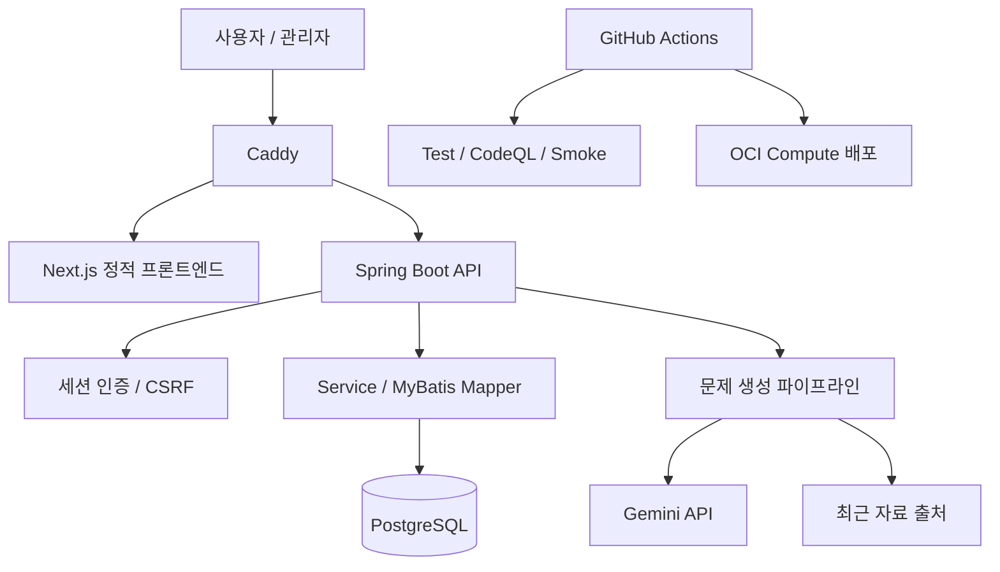
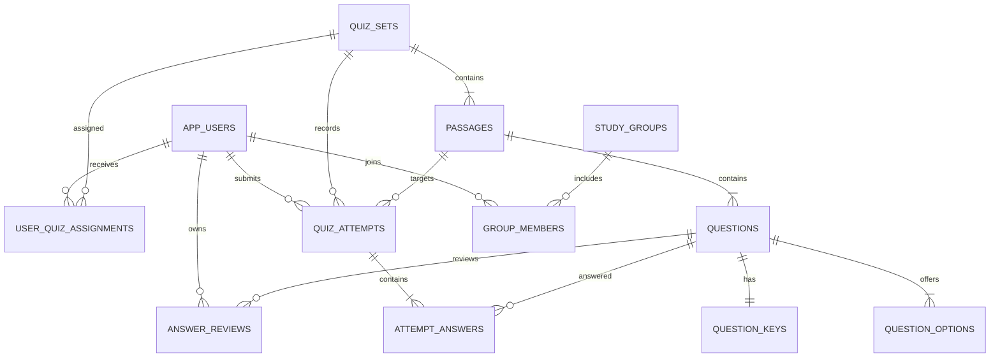
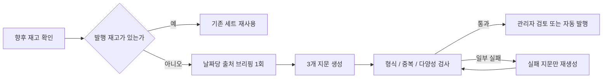

# TRI:READ 백엔드 설계

이 문서는 포트폴리오 검토자가 코드에 들어가기 전에 서비스 경계, 핵심 데이터 관계와 주요 설계 판단을 빠르게 확인할 수 있도록 정리한 자료입니다.

## 서비스 구성

운영 서버는 Caddy, Spring Boot, PostgreSQL을 Docker Compose로 실행합니다. 외부에는 80/443만 열고 API와 DB 포트는 Docker 내부 네트워크에 둡니다.

## 핵심 데이터 관계

날짜별 퀴즈는 사용자에게 한 번 배정되면 `user_quiz_assignments`에 고정됩니다. 응시는 지문 단위이며, 하루 첫 지문만 `PRIMARY`, 나머지는 `BONUS`로 저장합니다. 이 제약을 PostgreSQL 인덱스와 서비스 검증 양쪽에서 지킵니다.

## 문제 생성 흐름

전체 결과를 매번 다시 생성하지 않고 실패한 지문만 보완하며, 같은 작업에서는 저장한 출처와 프롬프트 버전을 재사용합니다. 일일 작업 수와 API 호출 수를 별도로 제한해 재시도로 인한 비용 폭증을 막습니다.

## 주요 설계 결정

| 결정 | 이유 |
| --- | --- |
| MyBatis와 명시적인 SQL | 학습·응시·품질 집계 쿼리를 직접 읽고 조정하기 쉽고 PostgreSQL 제약을 분명히 드러내기 위해 선택했습니다. |
| Flyway 버전 마이그레이션 | 로컬, CI, OCI가 같은 순서로 스키마를 재현하도록 했습니다. |
| 서버 세션과 CSRF | 브라우저 서비스에서 토큰을 클라이언트 저장소에 노출하지 않고 상태 변경 요청을 보호합니다. |
| 사용자별 고정 배정 | 문제 풀이 중 새로고침하거나 다시 로그인해도 오늘의 지문이 바뀌지 않게 합니다. |
| 로컬 검증 우선 | 구조·중복·문항 다양성은 Java에서 먼저 검사하고, 선택적 AI 재검증은 마지막 단계에만 호출합니다. |
| DB 프롬프트 버전 관리 | 관리자가 생성·검증 프롬프트를 바꾸고 활성화·롤백 이력을 남길 수 있게 합니다. |

## 해결한 문제

### 퀴즈 조회 계약 불일치

사용자별 퀴즈 배정이 생기면서 단순 조회였던 오늘 퀴즈 API가 서버 상태를 만들게 됐습니다. 프론트와 백엔드의 HTTP 메서드가 달라 운영에서 404가 발생했고, 계약을 한 메서드로 통일한 뒤 운영 스모크 테스트에 오늘 퀴즈 확인을 포함했습니다.

### 생성 재시도로 인한 API 호출 증가

초기에는 검증 실패 때 전체 세트를 다시 생성해 호출량이 빠르게 늘었습니다. 날짜별 출처 브리핑 재사용, 로컬 중복 검사, 실패 지문 부분 재생성, 작업·호출 일일 한도를 추가해 외부 API 사용량을 제한했습니다.

### 학습일과 표시일 불일치

주말 보충과 자정 경계에서 제출 시각만 사용하면 다른 날짜의 기록이 켜질 수 있었습니다. 응시가 귀속되는 학습일을 명시적으로 저장하고, 기록 조회와 스트릭 계산이 같은 날짜 기준을 사용하도록 통일했습니다.

## 검증 근거

- `./gradlew test`: 145개 통과, 실패 0, 조건부 제외 3개 (2026-08-09 `dev`)
- Testcontainers: 빈 PostgreSQL에 Flyway 전체 적용 및 핵심 테이블 확인
- 통합 테스트: 문제 생성, 검증, 발행, 사용자 배정과 학습 흐름 확인
- CI: Gradle 테스트, CodeQL `security-extended`, 의존성 점검
- 운영: 배포 후 홈페이지와 `/api/health` 스모크 테스트, 6시간 주기 상태 확인
