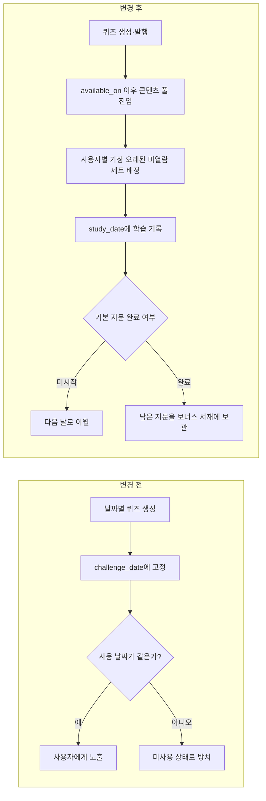

# 학습 정책·퀴즈 배정 트러블슈팅

## 2026-08-22 — 날짜가 지난 퀴즈가 사용되지 않는 구조 개선

### 분류

- 유형: 운영 정책·데이터 모델 개선
- 영향 범위: PostgreSQL, Spring Boot/MyBatis, Next.js 사용자 화면, 자동 생성 스케줄러
- 관련 커밋: 백엔드 `0a9098c`, 프론트엔드 `03186c7`

### 1. 증상

관리자 화면에는 여러 날짜의 발행된 퀴즈가 쌓여 있었지만, 사용자 화면은 당일 날짜와 정확히 일치하는 퀴즈만 조회했습니다. 해당 날짜에 사용되지 않은 퀴즈는 정상적으로 생성·검증·발행됐어도 날짜가 지나면 다시 노출될 경로가 없었습니다.

그 결과 다음 문제가 생겼습니다.

- Gemini 호출과 검증 비용을 들여 만든 콘텐츠가 사용되지 않음
- 특정 날짜의 생성이나 발행이 비면 사용자에게 `오늘 준비된 퀴즈가 없어요`가 표시됨
- 미시작 퀴즈와 기본 지문만 푼 퀴즈의 남은 지문이 날짜 경과 후 방치됨
- 콘텐츠 생산 일정과 사용자 학습 일정이 강하게 결합됨

### 2. 원인 분석

`quiz_sets.challenge_date`가 서로 다른 두 의미를 동시에 담당한 것이 근본 원인이었습니다.

1. 운영자가 콘텐츠를 생성·검토·발행하기 위한 기준 날짜
2. 사용자가 실제로 학습하는 날짜

사용자 배정 테이블도 `(user_id, challenge_date)`를 기준으로 퀴즈 세트의 날짜와 결합돼 있었습니다. 따라서 퀴즈 자체의 날짜를 변경하지 않는 한 지난 콘텐츠를 오늘 학습으로 배정할 수 없었습니다.

기존 스케줄러에는 아무도 배정받지 않은 과거 퀴즈의 날짜를 미래로 옮기는 재활용 로직이 있었지만, 다음 문제가 있었습니다.

- 콘텐츠의 원래 생성·운영 이력이 변경됨
- 일부 사용자에게 이미 배정된 콘텐츠는 재활용할 수 없음
- 사용자별 열람 여부와 남은 지문 상태를 표현할 수 없음

### 3. 해결 방향

퀴즈를 특정 학습 날짜의 소모품이 아니라, 공개일 이후 사용자별로 한 번씩 소비하는 콘텐츠 풀로 변경했습니다.

### 4. 구현

#### DB

Flyway V15 마이그레이션으로 다음 필드를 추가했습니다.

- `quiz_sets.available_on`: 콘텐츠 풀에 들어갈 수 있는 날짜
- `quiz_sets.retired_at`: 운영자가 콘텐츠를 풀에서 제외할 수 있는 시각
- `user_quiz_assignments.study_date`: 사용자가 실제로 배정받아 학습한 날짜

기존 데이터는 `available_on = challenge_date`, `study_date = challenge_date`로 보정해 과거 기록을 유지했습니다. 퀴즈와 배정의 날짜 복합 외래 키는 퀴즈 ID 외래 키로 변경하고, 사용자별 학습일 유일 제약을 추가했습니다.

#### 백엔드

- 오늘 배정이 없으면 가장 오래된 미열람 발행 퀴즈를 콘텐츠 풀에서 선택
- 이전 날짜에 배정됐지만 시도하지 않은 퀴즈는 오늘로 이월
- 기본 지문을 완료한 과거 세트의 남은 지문을 `/api/quizzes/bonus`로 제공
- 과거 세트는 기본 지문 완료 이후에만 보너스 제출 허용
- 생성 기본값을 날짜당 3세트에서 1세트로 조정
- 과거 퀴즈의 생성 날짜를 변경하던 재활용 로직 제거
- 학습 기록, 오답, 그룹 활동, 주간 궤도를 `study_date` 기준으로 집계

#### 프론트엔드

- 오늘 퀴즈와 과거 보너스 퀴즈를 함께 조회
- 기본 지문을 완료한 과거 퀴즈의 남은 지문을 `보너스 서재`에 표시
- 보너스 지문을 선택하면 해당 퀴즈로 이동
- 과거 퀴즈에서는 `오늘` 대신 실제 `보너스 학습일` 표시
- PC와 모바일 핵심 흐름에 Playwright 시나리오 추가

### 5. 검증

#### 로컬

- 백엔드 테스트: 165개, 실패 0개
- 로컬 Docker 미가동으로 Testcontainers 통합 테스트 3개는 스킵
- 프론트엔드 프로덕션 빌드 성공
- Playwright E2E: 30개 통과, 의도된 2개 스킵

#### GitHub Actions

- 백엔드 dev CI와 CodeQL 통과
- 프론트엔드 dev CI와 CodeQL 통과
- 두 저장소 모두 승격 PR 자동 병합과 main CI 통과

#### 운영

- 백엔드를 먼저 배포해 Flyway V15 적용 및 API 호환성 확보
- OCI 서비스 재기동과 운영 스모크 테스트 통과
- 이후 프론트엔드 배포와 운영 스모크 테스트 통과
- 운영 `/quiz/` 최종 응답 HTTP 200 확인
- `/api/quizzes/bonus` 비로그인 요청이 HTTP 401을 반환해 신규 경로와 인증 보호가 함께 동작함을 확인

### 6. 결과

- 날짜가 지난 발행 퀴즈도 사용자별 미열람 콘텐츠로 계속 사용 가능
- 사용하지 못한 퀴즈가 다음 날 이어져 학습 공백 감소
- 기본 지문 이후 남은 두 지문을 과거 날짜와 무관하게 활용 가능
- 콘텐츠 생성 비용과 Gemini 호출 낭비 감소
- 콘텐츠 생산 일정과 사용자 학습 일정의 결합 제거
- 생성·운영 이력은 원래 날짜로 보존하면서 사용자 학습 기록은 실제 날짜로 집계

### 7. 남은 관찰 항목

- 사용자별 미열람 풀 크기와 소진 속도
- 미시작 이월 비율과 보너스 지문 완료율
- 풀 고갈 시 사용자 안내와 생성 복구 동작
- `retired_at`을 사용하는 관리자 제외 기능의 필요 시점
- 운영 데이터가 쌓인 뒤 풀 조회 인덱스의 실행 계획과 응답 시간

### 8. 회고

운영 화면에 퀴즈가 존재한다는 사실만으로 사용자에게 학습 콘텐츠가 제공된다고 판단할 수 없었습니다. 콘텐츠의 생성 상태와 사용자별 소비 상태를 분리해 관찰해야 했습니다. 날짜 값을 재작성하는 방식보다 콘텐츠의 공개 가능 시점과 실제 학습일을 별도 모델링하는 방식이 이력 보존, 재사용, 통계 정확성을 함께 만족했습니다.
